# JDeduplix: AI-Powered Smart Deduplication System

JDeduplix is a cutting-edge deduplication system that leverages artificial intelligence and decentralized technologies to provide intelligent, accurate, and efficient data deduplication across multiple data types. Built with Rust for performance and safety, it combines advanced AI models with peer-to-peer networking and CRDT-based version control to create a powerful, flexible, and scalable solution.

## ✨ Highlights

- **Multi-Modal AI Deduplication**: Specialized AI models for text, JSON, images, and binary data
- **Pluggable P2P Architecture**: Support for both LibP2P and Holepunch protocols out of the box
- **Distributed Processing**: Scale horizontally with distributed worker nodes
- **Smart Conflict Resolution**: ML-powered conflict detection with human-in-the-loop capabilities
- **High-Performance Vector Search**: FAISS HNSW for efficient similarity matching
- **Modern UI**: Tauri + Vue frontend with real-time visualizations
- **Flexible Storage**: Multiple backend options including decentralized storage
- **CRDT-Based Version Control**: Loro-powered versioning with automatic conflict resolution
- **Rich Data Types**: Support for complex data structures with semantic merging

## 🎯 Use Cases

- **Enterprise Data Management**: Eliminate redundant data across large organizations
- **Content Distribution**: Efficient content sharing with decentralized storage
- **Digital Asset Management**: Smart deduplication of media files and assets
- **Database Optimization**: Reduce storage costs with intelligent data deduplication
- **Collaborative Environments**: P2P sharing with version control and conflict resolution
- **Edge Computing**: Distributed processing with local and network storage options
- **Collaborative Deduplication**: Real-time collaboration with automatic conflict resolution
- **Version-Aware Storage**: Track and manage data versions with semantic understanding

## 💡 Key Features

### AI-Powered Deduplication
- **Smart Classification**: Automatic content type detection and routing
- **Specialized Engines**:
  - ML Text Deduper for documents and code
  - GNN JSON Deduper for structured data
  - CNN Image Deduper for visual content
  - Deep Learning Binary Deduper for raw data
- **Intelligent Matching**:
  - Fuzzy matching with confidence scoring
  - Perceptual hashing for media files
  - Graph-based structural similarity
  - Vector embedding comparison

### Decentralized Architecture
- **Pluggable P2P Layer**:
  - LibP2P with IPFS storage
  - Holepunch with Hypercore support
  - Protocol-agnostic adapter interface
  - Cross-protocol communication
- **Distributed Processing**:
  - Horizontal scaling with worker nodes
  - Load balancing and task distribution
  - Fault tolerance and recovery
  - Real-time progress monitoring

### Smart Storage
- **Multi-Backend Support**:
  - High-performance Sled DB
  - IPFS for decentralized storage
  - Hypercore for append-only data
  - Vector databases (Weaviate/Pinecone)
- **Intelligent Caching**:
  - Smart cache with vector indexing
  - Content-aware caching strategies
  - Distributed cache coordination
  - Automatic cache invalidation

### CRDT Version Control
- **Loro Integration**:
  - High-performance CRDT implementation
  - Rich data type support (Text, List, Map, Tree)
  - Automatic semantic merging
  - Branch and fork support
- **Version Management**:
  - Complete DAG-based history tracking
  - Branch-based workflow
  - Automatic conflict resolution
  - Manual conflict resolution when needed
- **Collaborative Features**:
  - Real-time multi-user editing
  - Branch-level permissions
  - Version diffing and comparison
  - Semantic merge previews
- **Performance Optimizations**:
  - Fast document loading (sub-millisecond)
  - Shallow snapshot support
  - Block-level storage
  - Selective history loading

### Advanced Features
- **ML Conflict Resolution**:
  - Confidence-weighted decisions
  - Automated threshold tuning
  - Human review integration
  - Learning from feedback
- **Version Control**:
  - Full history tracking
  - Change auditing
  - Rollback capabilities
  - Branch management
- **API Integration**:
  - REST and WebSocket APIs
  - Client SDKs
  - Real-time events
  - Comprehensive documentation

## 🛠️ Technical Stack

### Frontend
- **Framework**: Tauri + Vue.js
- **UI Components**: Custom-built with dark theme
- **Visualizations**: Real-time graphs and heatmaps
- **P2P Controls**: Protocol selection and network management

### Backend
- **Core**: Rust for performance and safety
- **AI Framework**: Custom ML pipeline
- **Vector Search**: FAISS HNSW
- **P2P**: LibP2P and Holepunch implementations
- **Version Control**: Loro CRDT (v1.0+)
  - Rich CRDT types
  - High-performance DAG
  - Semantic merging
  - Block-level storage

### Storage
- **Local**: 
  - Sled DB for high performance
  - Loro block storage for versions
- **Distributed**: 
  - IPFS and Hypercore
  - CRDT-aware replication
- **Vector**: Weaviate/Pinecone integration
- **Version History**: Loro DAG-based tracking

## 🔄 Version Control Features

### Rich Data Types
- **Text CRDT**: Smart merging of formatted text
- **List CRDT**: Ordered collections with move support
- **Map CRDT**: Key-value structures
- **Tree CRDT**: Hierarchical data with move operations
- **Nested Types**: Complex JSON-like structures

### Version Management
- **Branch Operations**:
  - Create/switch branches
  - Fork for independent work
  - Merge with automatic conflict resolution
  - Rebase/squash support (WIP)
- **History Navigation**:
  - Checkout specific versions
  - Browse version DAG
  - Compare versions
  - Selective loading

### Collaboration
- **Real-time Features**:
  - Multi-user editing
  - Automatic merging
  - Conflict prevention
  - Change visualization
- **Integration**:
  - P2P synchronization
  - Distributed storage
  - External VCS bridges
  - API access

## 📊 System Architecture

### Full Stack Overview

```mermaid
%%{init: {'theme': 'dark', 'themeVariables': { 'darkMode': true }}}%%
flowchart TD
    classDef primary fill:#42b883,stroke:#35495e,stroke-width:2px,color:#1a1c1d
    classDef secondary fill:#3eaf7c,stroke:#2c3e50,stroke-width:2px,color:#1a1c1d
    classDef action fill:#4fc08d,stroke:#2c3e50,stroke-width:2px,color:#1a1c1d
    classDef api fill:#ff9f43,stroke:#e67e22,stroke-width:2px,color:#1a1c1d
    classDef storage fill:#00b894,stroke:#00cec9,stroke-width:2px,color:#1a1c1d
    classDef dist fill:#6c5ce7,stroke:#a29bfe,stroke-width:2px,color:#1a1c1d
    classDef backend fill:#0984e3,stroke:#74b9ff,stroke-width:2px,color:#1a1c1d
    classDef p2p fill:#00b894,stroke:#00cec9,stroke-width:2px,color:#1a1c1d
    classDef version fill:#fd79a8,stroke:#e84393,stroke-width:2px,color:#1a1c1d

    subgraph UI[User Interface Layer]
        direction TB
        FE[Frontend App]:::primary
        SDK[Client SDK]:::secondary
        API[API Gateway]:::api
    end

    subgraph BE[Backend Layer]
        direction TB
        AI[AI Processing]:::backend
        IDX[Smart Indexing]:::backend
        DIST[Distributed Coordinator]:::dist
    end

    subgraph ST[Storage Layer]
        direction TB
        DB[(Local DB)]:::storage
        FS[File System]:::storage
        VDB[(Vector DB)]:::storage
    end

    subgraph P2P[P2P Network]
        direction TB
        LIBP2P[LibP2P Stack]:::p2p
        HOLE[Holepunch Stack]:::p2p
        DHT[DHT]:::p2p
        IPFS[IPFS]:::p2p
    end

    subgraph VCS[Version Control Service]
        direction TB
        CRDT[Loro CRDT]:::version
        BRANCH[Branch Manager]:::version
        MERGE[Merge Handler]:::version
        DAG[History DAG]:::version
        BLOCK[Block Storage]:::version
        
        CRDT --> BRANCH
        CRDT --> MERGE
        BRANCH --> DAG
        MERGE --> DAG
        DAG --> BLOCK
    end

    FE --> SDK
    SDK --> API
    API --> AI
    API --> IDX
    API --> DIST
    API --> VCS
    
    AI --> DB
    AI --> VDB
    IDX --> VDB
    IDX --> FS
    DIST --> P2P
    VCS --> P2P
    
    LIBP2P --> DHT
    LIBP2P --> IPFS
    HOLE --> DHT

    style UI fill:#1a1c1d,stroke:#42b883,stroke-width:2px
    style BE fill:#1a1c1d,stroke:#0984e3,stroke-width:2px
    style ST fill:#1a1c1d,stroke:#00b894,stroke-width:2px
    style P2P fill:#1a1c1d,stroke:#00b894,stroke-width:2px
    style VCS fill:#1a1c1d,stroke:#fd79a8,stroke-width:2px
```

### Frontend Architecture

```mermaid
%%{init: {'theme': 'dark', 'themeVariables': { 'darkMode': true }}}%%
flowchart TD
    classDef primary fill:#42b883,stroke:#35495e,stroke-width:2px,color:#1a1c1d
    classDef secondary fill:#3eaf7c,stroke:#2c3e50,stroke-width:2px,color:#1a1c1d
    classDef action fill:#4fc08d,stroke:#2c3e50,stroke-width:2px,color:#1a1c1d
    classDef api fill:#ff9f43,stroke:#e67e22,stroke-width:2px,color:#1a1c1d
    classDef p2p fill:#00b894,stroke:#00cec9,stroke-width:2px,color:#1a1c1d
    classDef version fill:#fd79a8,stroke:#e84393,stroke-width:2px,color:#1a1c1d

    subgraph UI[User Interface]
        direction TB
        A[User Dashboard]:::primary
        B[Upload Interface]:::primary
        C[Results View]:::primary
        D[Smart Classifier UI]:::secondary
        E[Manual Resolution]:::secondary
        F[AI Confidence Display]:::secondary
        G[Similarity Heatmap]:::secondary
        H[Export Options]:::action
        I[Download]:::action
        J[Share]:::action
        K[API Documentation]:::api
        M[Integration Hub]:::api
        
        subgraph P2P[P2P Controls]
            direction TB
            N[Protocol Selector]:::p2p
            O[Peer Manager]:::p2p
            P[Network Stats]:::p2p
            Q[Storage Config]:::p2p
        end
    end

    subgraph VCS[Version Controls]
        direction TB
        V[Branch Manager]:::version
        W[Merge UI]:::version
        X[History Browser]:::version
        Y[Diff Viewer]:::version
        L[Version History]:::version
        
        V --> W
        V --> X
        X --> Y
        X --> L
    end
    
    A --> B
    A --> C
    A --> K
    A --> M
    A --> P2P
    A -.-> VCS
    B --> D
    C --> E
    C --> F
    C --> G
    E & F & G --> H
    H --> I
    H --> J
    
    N --> O
    O --> P
    N --> Q
    
    M --> |External Systems| K
    O --> |Network Status| P

    style UI fill:#1a1c1d,stroke:#42b883,stroke-width:2px
    style P2P fill:#1a1c1d,stroke:#00b894,stroke-width:2px
    style VCS fill:#1a1c1d,stroke:#fd79a8,stroke-width:2px
```

### Backend Architecture

```mermaid
%%{init: {'theme': 'dark', 'themeVariables': { 'darkMode': true }}}%%
flowchart TD
    classDef engine fill:#2b7489,stroke:#1a1c1d,stroke-width:2px,color:white
    classDef ai fill:#6b9fff,stroke:#2d5a9e,stroke-width:2px,color:#1a1c1d
    classDef storage fill:#ff6b6b,stroke:#c92a2a,stroke-width:2px,color:white
    classDef dist fill:#a55eea,stroke:#8854d0,stroke-width:2px,color:white
    classDef version fill:#20bf6b,stroke:#26de81,stroke-width:2px,color:#1a1c1d
    classDef p2p fill:#00b894,stroke:#00cec9,stroke-width:2px,color:#1a1c1d
    classDef adapter fill:#6c5ce7,stroke:#a29bfe,stroke-width:2px,color:white

    subgraph Core[Deduplication Core]
        direction TB
        A[Smart Classifier]:::engine
        B[Deduplication Engine]:::engine
        C[AI Processing Pipeline]:::ai
        D1[ML Text Deduper]:::ai
        D2[GNN JSON Deduper]:::ai
        D3[CNN Image Deduper]:::ai
        D4[Binary Deduper]:::ai
        E[ML Conflict Resolver]:::ai
        F[Auto-Tuning]:::ai
        G[Vector Indexing]:::engine
        H1[FAISS HNSW]:::engine
        H2[Perceptual Hash]:::engine
        H3[Graph Matching]:::engine
        I[Storage Layer]:::storage
        J1[Sled DB]:::storage
        J2[File System]:::storage
        J3[Vector DB]:::storage
        
        %% Core Components
        K[Model Registry]:::ai
        L[Feedback Loop]:::ai
        M[API Gateway]:::engine
        
        %% P2P Components
        Q[P2P Manager]:::p2p
        R[Protocol Adapter]:::adapter
        S1[LibP2P Implementation]:::p2p
        S2[Holepunch Implementation]:::p2p
        T[Peer Discovery]:::p2p
        U[Content Router]:::p2p
        V[Replication Manager]:::p2p
        W[Storage Adapter]:::adapter
        X1[IPFS Storage]:::p2p
        X2[Hypercore Storage]:::p2p
        
        A --> B
        B --> C
        C --> D1 & D2 & D3 & D4
        D1 & D2 & D3 & D4 --> E
        E --> F
        B --> G
        G --> H1 & H2 & H3
        H1 & H2 & H3 --> I
        I --> J1 & J2 & J3
        
        %% Core Connections
        E --> L
        L --> K
        K --> C
        B --> M
        
        %% P2P Connections
        B <--> Q
        Q --> R
        R --> S1 & S2
        S1 & S2 --> T
        T --> U
        U --> V
        V --> W
        W --> X1 & X2
        X1 & X2 --> I
        
        %% Feedback Loops
        L --> |Model Updates| D1 & D2 & D3 & D4
        F --> |Threshold Updates| L
        M --> |API Requests| B
        V --> |P2P Updates| L
    end

    subgraph VCS[Version Control Service]
        direction TB
        CRDT[Loro CRDT]:::version
        BRANCH[Branch Manager]:::version
        MERGE[Merge Handler]:::version
        DAG[History DAG]:::version
        BLOCK[Block Storage]:::version
        
        CRDT --> BRANCH
        CRDT --> MERGE
        BRANCH --> DAG
        MERGE --> DAG
        DAG --> BLOCK
    end

    style Core fill:#1a1c1d,stroke:#2b7489,stroke-width:2px
    style VCS fill:#1a1c1d,stroke:#20bf6b,stroke-width:2px
```

## 🌟 Key Features

- **Smart Classification**: AI-powered detection and routing of different data types
- **Multi-Modal Deduplication**: Specialized engines for text, JSON, images, and binary data
- **ML-Enhanced Matching**: Combines exact and fuzzy matching using advanced AI models
- **Intelligent Conflict Resolution**: Machine learning-assisted conflict handling with human oversight
- **High-Performance Search**: Vector-based similarity search using FAISS HNSW
- **Flexible Storage**: Pluggable storage backends supporting Sled DB, file system, and vector databases
- **P2P Capabilities**: Decentralized data sharing and deduplication using IPFS and LibP2P
- **CRDT-Based Version Control**: Loro-powered versioning with automatic conflict resolution
- **Rich Data Types**: Support for complex data structures with semantic merging

## 🏗️ Architecture

### Frontend (Tauri + Vue)
- Modern, responsive UI for data visualization and management
- AI confidence score displays and similarity heatmaps
- Interactive conflict resolution interface
- Export and download capabilities
- P2P network controls and protocol selection

### Backend (Rust + AI)
- **Deduplication Engine**:
  - ML Text Deduper
  - GNN JSON Deduper
  - CNN Image Deduper
  - Deep Learning Binary Deduper
  
- **Smart Indexing**:
  - FAISS HNSW Vector Search
  - Perceptual Hashing
  - Graph Matching Algorithms

- **ML Conflict Resolution**:
  - Confidence-weighted decision making
  - Automated threshold tuning
  - Human-in-the-loop review system

- **P2P Network Layer**:
  - Pluggable protocol architecture
  - LibP2P implementation with IPFS storage
  - Holepunch implementation with Hypercore storage
  - Protocol-agnostic adapter interface
  - Unified peer discovery and routing
  - Cross-protocol replication support

- **Version Control**:
  - Loro CRDT (v1.0+)
  - Rich CRDT types
  - High-performance DAG
  - Semantic merging
  - Block-level storage

### Storage Options
- Sled DB for high-performance local storage
- File system integration for simple deployments
- Vector DB support (Weaviate/Pinecone)
- IPFS for LibP2P-based storage
- Hypercore for Holepunch-based storage
- Loro block storage for versions

## 🚀 Getting Started

[Coming Soon]

## 🛠️ Development

[Coming Soon]

## 📚 Documentation

[Coming Soon]

## 🤝 Contributing

[Coming Soon]

## 📄 License

[Coming Soon]

## 🔗 Links

[Coming Soon]