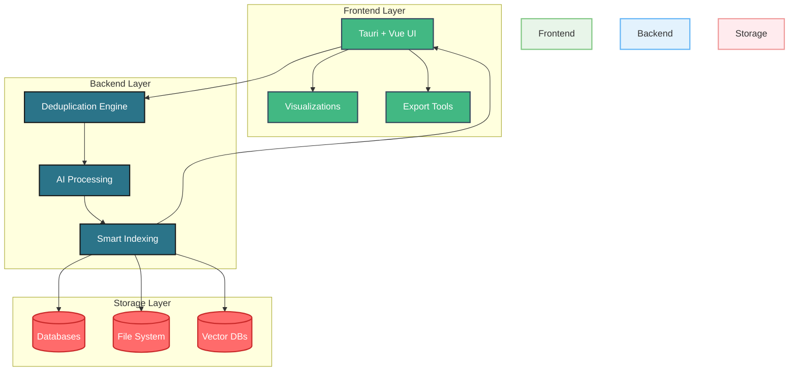

# JDeduplix: AI-Powered Smart Deduplication System

JDeduplix is a cutting-edge deduplication system that leverages artificial intelligence to provide intelligent, accurate, and efficient data deduplication across multiple data types.

## 📊 System Architecture

### Full Stack Overview



### Frontend Architecture

```mermaid
graph TD
    classDef primary fill:#42b883,stroke:#35495e,stroke-width:2px,color:white
    classDef secondary fill:#3eaf7c,stroke:#2c3e50,stroke-width:2px,color:white
    classDef action fill:#4fc08d,stroke:#2c3e50,stroke-width:2px,color:white

    subgraph "User Interface"
        A[User Dashboard]:::primary --> B[Upload Interface]:::primary
        A --> C[Results View]:::primary
        
        B --> D[Smart Classifier UI]:::secondary
        C --> E[Manual Resolution]:::secondary
        C --> F[AI Confidence Display]:::secondary
        C --> G[Similarity Heatmap]:::secondary
        
        E & F & G --> H[Export Options]:::action
        H --> I[Download]:::action
        H --> J[Share]:::action
    end

    style "User Interface" fill:#f8f9fa,stroke:#42b883,stroke-width:2px
```

### Backend Architecture

```mermaid
graph TD
    classDef engine fill:#2b7489,stroke:#1a1c1d,stroke-width:2px,color:white
    classDef ai fill:#6b9fff,stroke:#2d5a9e,stroke-width:2px,color:white
    classDef storage fill:#ff6b6b,stroke:#c92a2a,stroke-width:2px,color:white

    subgraph "Deduplication Core"
        A[Smart Classifier]:::engine --> B[Deduplication Engine]:::engine
        
        B --> C[AI Processing Pipeline]:::ai
        C --> D1[ML Text Deduper]:::ai
        C --> D2[GNN JSON Deduper]:::ai
        C --> D3[CNN Image Deduper]:::ai
        C --> D4[Binary Deduper]:::ai
        
        D1 & D2 & D3 & D4 --> E[ML Conflict Resolver]:::ai
        E --> F[Auto-Tuning]:::ai
        
        B --> G[Vector Indexing]:::engine
        G --> H1[FAISS HNSW]:::engine
        G --> H2[Perceptual Hash]:::engine
        G --> H3[Graph Matching]:::engine
        
        H1 & H2 & H3 --> I[Storage Layer]:::storage
        I --> J1[Sled DB]:::storage
        I --> J2[File System]:::storage
        I --> J3[Vector DB]:::storage
    end

    style "Deduplication Core" fill:#f8f9fa,stroke:#2b7489,stroke-width:2px
```

## 🌟 Key Features

- **Smart Classification**: AI-powered detection and routing of different data types
- **Multi-Modal Deduplication**: Specialized engines for text, JSON, images, and binary data
- **ML-Enhanced Matching**: Combines exact and fuzzy matching using advanced AI models
- **Intelligent Conflict Resolution**: Machine learning-assisted conflict handling with human oversight
- **High-Performance Search**: Vector-based similarity search using FAISS HNSW
- **Flexible Storage**: Pluggable storage backends supporting Sled DB, file system, and vector databases

## 🏗️ Architecture

### Frontend (Tauri + Vue)
- Modern, responsive UI for data visualization and management
- AI confidence score displays and similarity heatmaps
- Interactive conflict resolution interface
- Export and download capabilities

### Backend (Rust + AI)
- **Deduplication Engine**:
  - ML Text Deduper
  - GNN JSON Deduper
  - CNN Image Deduper
  - Deep Learning Binary Deduper
  
- **Smart Indexing**:
  - FAISS HNSW Vector Search
  - Perceptual Hashing
  - Graph Matching Algorithms

- **ML Conflict Resolution**:
  - Confidence-weighted decision making
  - Automated threshold tuning
  - Human-in-the-loop review system

### Storage Options
- Sled DB for high-performance local storage
- File system integration for simple deployments
- Vector DB support (Weaviate/Pinecone) for advanced similarity search

## 🚀 Getting Started

[Coming Soon]

## 🛠️ Development

[Coming Soon]

## 📚 Documentation

[Coming Soon]

## 🤝 Contributing

[Coming Soon]

## 📄 License

[Coming Soon]

## 🔗 Links

[Coming Soon]