# JDeduplix: AI-Powered Smart Deduplication System

JDeduplix is a cutting-edge deduplication system that leverages artificial intelligence to provide intelligent, accurate, and efficient data deduplication across multiple data types.

## 📊 System Architecture

### Full Stack Overview

```mermaid
%%{init: {'theme': 'dark', 'themeVariables': { 'darkMode': true }}}%%
flowchart TD
    classDef frontend fill:#42b883,stroke:#35495e,stroke-width:2px,color:#1a1c1d
    classDef backend fill:#2b7489,stroke:#1a1c1d,stroke-width:2px,color:white
    classDef storage fill:#ff6b6b,stroke:#c92a2a,stroke-width:2px,color:white
    classDef api fill:#ff9f43,stroke:#e67e22,stroke-width:2px,color:#1a1c1d
    classDef dist fill:#a55eea,stroke:#8854d0,stroke-width:2px,color:white

    subgraph FE[Frontend Layer]
        direction TB
        UI[Tauri + Vue UI]:::frontend
        VIS[Visualizations]:::frontend
        EXP[Export Tools]:::frontend
        APIC[API Console]:::frontend
    end

    subgraph BE[Backend Layer]
        direction TB
        DE[Deduplication Engine]:::backend
        AI[AI Processing]:::backend
        IDX[Smart Indexing]:::backend
        DIST[Distributed Coordinator]:::dist
    end

    subgraph ST[Storage Layer]
        direction TB
        DB[(Databases)]:::storage
        FS[(File System)]:::storage
        VDB[(Vector DBs)]:::storage
        GIT[(Version Control)]:::storage
    end

    subgraph AG[API Gateway]
        direction TB
        REST[REST API]:::api
        WS[WebSocket API]:::api
        SDK[Client SDKs]:::api
    end

    UI --> DE
    DE --> AI
    AI --> IDX
    IDX --> DB & FS & VDB & GIT
    IDX --> UI
    UI --> VIS & EXP & APIC
    
    DE <--> DIST
    
    APIC & UI --> REST & WS
    REST & WS --> SDK

    style FE fill:#1a1c1d,stroke:#42b883,stroke-width:2px
    style BE fill:#1a1c1d,stroke:#2b7489,stroke-width:2px
    style ST fill:#1a1c1d,stroke:#ff6b6b,stroke-width:2px
    style AG fill:#1a1c1d,stroke:#ff9f43,stroke-width:2px
```

### Frontend Architecture

```mermaid
%%{init: {'theme': 'dark', 'themeVariables': { 'darkMode': true }}}%%
flowchart TD
    classDef primary fill:#42b883,stroke:#35495e,stroke-width:2px,color:#1a1c1d
    classDef secondary fill:#3eaf7c,stroke:#2c3e50,stroke-width:2px,color:#1a1c1d
    classDef action fill:#4fc08d,stroke:#2c3e50,stroke-width:2px,color:#1a1c1d
    classDef api fill:#ff9f43,stroke:#e67e22,stroke-width:2px,color:#1a1c1d

    subgraph UI[User Interface]
        direction TB
        A[User Dashboard]:::primary
        B[Upload Interface]:::primary
        C[Results View]:::primary
        D[Smart Classifier UI]:::secondary
        E[Manual Resolution]:::secondary
        F[AI Confidence Display]:::secondary
        G[Similarity Heatmap]:::secondary
        H[Export Options]:::action
        I[Download]:::action
        J[Share]:::action
        K[API Documentation]:::api
        L[Version History]:::secondary
        M[Integration Hub]:::api
        
        A --> B
        A --> C
        A --> K
        A --> M
        B --> D
        C --> E
        C --> F
        C --> G
        C --> L
        E & F & G --> H
        H --> I
        H --> J
        
        M --> |External Systems| K
    end

    style UI fill:#1a1c1d,stroke:#42b883,stroke-width:2px
```

### Backend Architecture

```mermaid
%%{init: {'theme': 'dark', 'themeVariables': { 'darkMode': true }}}%%
flowchart TD
    classDef engine fill:#2b7489,stroke:#1a1c1d,stroke-width:2px,color:white
    classDef ai fill:#6b9fff,stroke:#2d5a9e,stroke-width:2px,color:#1a1c1d
    classDef storage fill:#ff6b6b,stroke:#c92a2a,stroke-width:2px,color:white
    classDef dist fill:#a55eea,stroke:#8854d0,stroke-width:2px,color:white
    classDef version fill:#20bf6b,stroke:#26de81,stroke-width:2px,color:#1a1c1d

    subgraph Core[Deduplication Core]
        direction TB
        A[Smart Classifier]:::engine
        B[Deduplication Engine]:::engine
        C[AI Processing Pipeline]:::ai
        D1[ML Text Deduper]:::ai
        D2[GNN JSON Deduper]:::ai
        D3[CNN Image Deduper]:::ai
        D4[Binary Deduper]:::ai
        E[ML Conflict Resolver]:::ai
        F[Auto-Tuning]:::ai
        G[Vector Indexing]:::engine
        H1[FAISS HNSW]:::engine
        H2[Perceptual Hash]:::engine
        H3[Graph Matching]:::engine
        I[Storage Layer]:::storage
        J1[Sled DB]:::storage
        J2[File System]:::storage
        J3[Vector DB]:::storage
        
        %% New Components
        K[Model Registry]:::ai
        L[Feedback Loop]:::ai
        M[Version Control]:::version
        N[Distributed Coordinator]:::dist
        O[Worker Nodes]:::dist
        P[API Gateway]:::engine
        
        A --> B
        B --> C
        C --> D1 & D2 & D3 & D4
        D1 & D2 & D3 & D4 --> E
        E --> F
        B --> G
        G --> H1 & H2 & H3
        H1 & H2 & H3 --> I
        I --> J1 & J2 & J3
        
        %% New Connections
        E --> L
        L --> K
        K --> C
        B --> M
        N --> O
        O --> B
        B --> P
        
        %% Feedback Loops
        L --> |Model Updates| D1 & D2 & D3 & D4
        F --> |Threshold Updates| L
        M --> |Version History| I
    end

    style Core fill:#1a1c1d,stroke:#2b7489,stroke-width:2px
```

## 🌟 Key Features

- **Smart Classification**: AI-powered detection and routing of different data types
- **Multi-Modal Deduplication**: Specialized engines for text, JSON, images, and binary data
- **ML-Enhanced Matching**: Combines exact and fuzzy matching using advanced AI models
- **Intelligent Conflict Resolution**: Machine learning-assisted conflict handling with human oversight
- **High-Performance Search**: Vector-based similarity search using FAISS HNSW
- **Flexible Storage**: Pluggable storage backends supporting Sled DB, file system, and vector databases

## 🏗️ Architecture

### Frontend (Tauri + Vue)
- Modern, responsive UI for data visualization and management
- AI confidence score displays and similarity heatmaps
- Interactive conflict resolution interface
- Export and download capabilities

### Backend (Rust + AI)
- **Deduplication Engine**:
  - ML Text Deduper
  - GNN JSON Deduper
  - CNN Image Deduper
  - Deep Learning Binary Deduper
  
- **Smart Indexing**:
  - FAISS HNSW Vector Search
  - Perceptual Hashing
  - Graph Matching Algorithms

- **ML Conflict Resolution**:
  - Confidence-weighted decision making
  - Automated threshold tuning
  - Human-in-the-loop review system

### Storage Options
- Sled DB for high-performance local storage
- File system integration for simple deployments
- Vector DB support (Weaviate/Pinecone) for advanced similarity search

## 🚀 Getting Started

[Coming Soon]

## 🛠️ Development

[Coming Soon]

## 📚 Documentation

[Coming Soon]

## 🤝 Contributing

[Coming Soon]

## 📄 License

[Coming Soon]

## 🔗 Links

[Coming Soon]